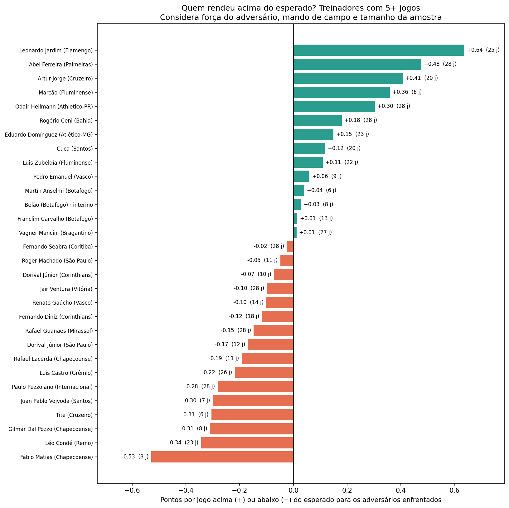
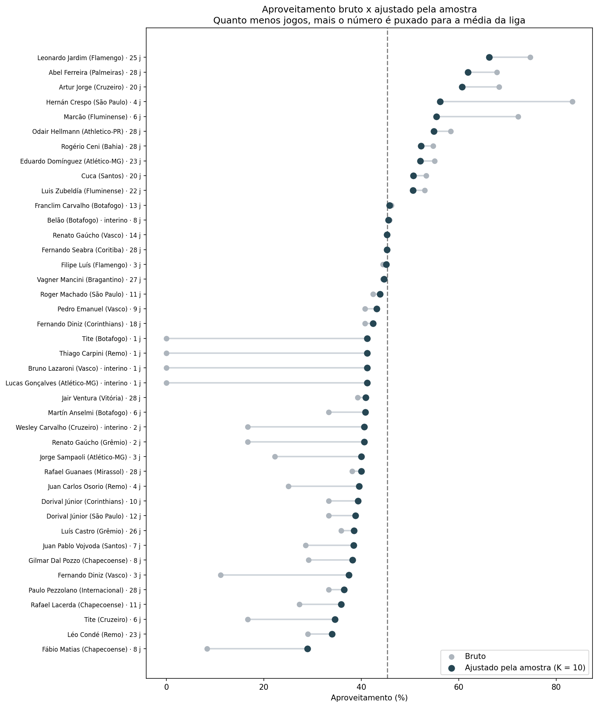
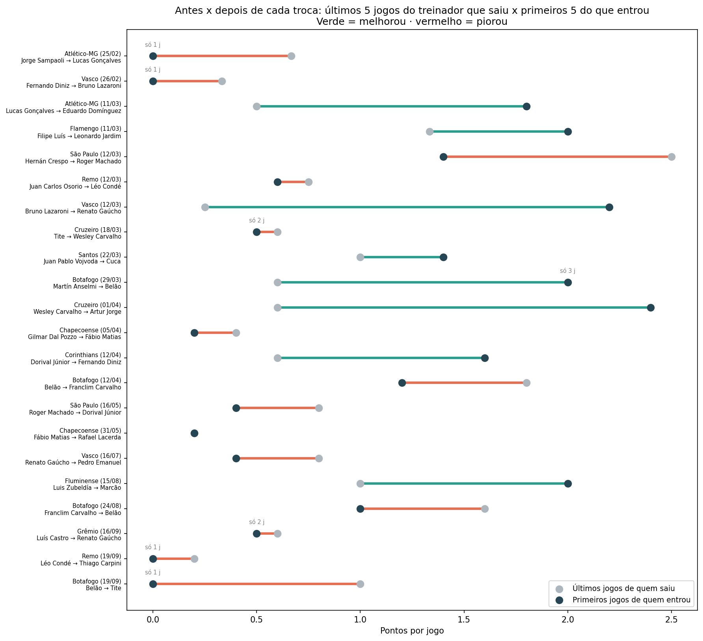

# O peso do treinador no Brasileirão 2026

Quanto do desempenho de um time é mérito do treinador? Este projeto analisa **todas as passagens de treinadores pela Série A 2026**, incluindo interinos, e tenta isolar o trabalho de cada um daquilo que ele não controla: o tamanho da amostra, a força dos adversários, o mando de campo e a qualidade do elenco.

> Dados até a **28ª rodada** (277 partidas). Classificação recalculada a partir dos placares e conferida com a tabela oficial: os 20 clubes batem em pontos e jogos.
>
> Outros projetos: [Dinheiro e Desempenho no Brasileirão 2026](https://github.com/enriquefroes/futebol-dinheiro-e-desempenho) · [Reforços e saídas de Atlético-MG e Cruzeiro](https://github.com/enriquefroes/reforcos-galo-cruzeiro-2026)

---

## Perguntas

| Notebook | Pergunta |
|---|---|
| `01_aproveitamento` | Qual o aproveitamento de cada treinador? Quantos pontos fariam em 38 rodadas? De quem são os pontos de cada clube? |
| `02_isolando_o_treinador` | Descontando amostra, adversários, mando e folha salarial, quem realmente rendeu acima do esperado? |
| `03_trocas_de_treinador` | Trocar de treinador melhora o time, ou é só a volta natural à média? |

## O campeonato em números

- **41 passagens** de **37 treinadores** diferentes, sendo **4 interinos** (Lucas Gonçalves, Bruno Lazaroni, Wesley Carvalho e Belão).
- **7 clubes** não trocaram de treinador: Palmeiras, Bahia, Mirassol, Athletico-PR, Vitória, Bragantino e Coritiba.
- **4 treinadores** dirigiram dois clubes na mesma Série A: Tite, Fernando Diniz, Dorival Júnior e Renato Gaúcho.
- Média da liga: **1,36 ponto por jogo** (45,4% de aproveitamento). Mandantes fazem em média 1,69 ponto por jogo; visitantes, 1,04.

---

## Principais resultados

### 1. Quem rendeu acima do esperado



Pontos por jogo acima (+) ou abaixo (−) do esperado para os adversários enfrentados, já com o ajuste pela amostra (treinadores com 5 jogos ou mais):

| | Treinador | Clube | Jogos | Acima do esperado |
|---|---|---|---|---|
| 1 | Leonardo Jardim | Flamengo | 25 | +0,64 |
| 2 | Abel Ferreira | Palmeiras | 28 | +0,48 |
| 3 | Artur Jorge | Cruzeiro | 20 | +0,41 |
| 4 | Marcão | Fluminense | 6 | +0,36 |
| 5 | Odair Hellmann | Athletico-PR | 28 | +0,30 |
| … | | | | |
| 26 | Juan Pablo Vojvoda | Santos | 7 | −0,30 |
| 27 | Tite | Cruzeiro | 6 | −0,31 |
| 28 | Gilmar Dal Pozzo | Chapecoense | 8 | −0,31 |
| 29 | Léo Condé | Remo | 23 | −0,34 |
| 30 | Fábio Matias | Chapecoense | 8 | −0,53 |

**Leonardo Jardim** lidera em todos os critérios. **Odair Hellmann** se destaca no ajuste pela folha: com uma das menores folhas da Série A, rende 0,40 ponto por jogo acima do esperado para o elenco que tem, empatado com Jardim nesse critério.

### 2. O problema da amostra pequena



**Hernán Crespo** fez 10 pontos em 4 jogos pelo São Paulo: 83% de aproveitamento, o maior do campeonato. Mas quatro jogos dizem pouco. Com o ajuste pela amostra, o número cai para **56%**: ainda bom, mas longe de ser o melhor. No sentido oposto, os interinos com um único jogo perdido saem de 0% e se aproximam da média.

### 3. Mesmo elenco, trabalhos opostos

O Cruzeiro é o exemplo mais claro: **Tite** teve 16,7% de aproveitamento em 6 jogos (0,31 ponto por jogo abaixo do esperado); **Artur Jorge**, com praticamente o mesmo elenco, tem 68,3% em 20 jogos (0,41 acima).

### 4. Trocar de treinador funciona, mas menos do que parece



| Situação | Variação nos 5 jogos seguintes |
|---|---|
| Depois de **qualquer** sequência ruim de 5 jogos (sem troca) | +0,74 ponto por jogo |
| Depois de uma **troca de treinador** em situação parecida | +0,97 ponto por jogo |
| **Diferença atribuível à troca** | **+0,24 ponto por jogo** |

Times trocam de treinador no pior momento, e depois do fundo do poço a tendência natural é melhorar. A maior parte da melhora após uma troca é essa **regressão à média**; o efeito do novo treinador existe, mas é menor do que a sensação de "virada" sugere.

### 5. Mesmo treinador, dois clubes

| Treinador | 1º clube | Aproveitamento | 2º clube | Aproveitamento |
|---|---|---|---|---|
| Dorival Júnior | Corinthians (10 j) | 33,3% | São Paulo (12 j) | 33,3% |
| Fernando Diniz | Vasco (3 j) | 11,1% | Corinthians (18 j) | 40,7% |
| Renato Gaúcho | Vasco (14 j) | 45,2% | Grêmio (2 j) | 16,7% |
| Tite | Cruzeiro (6 j) | 16,7% | Botafogo (1 j) | 0,0% |

---

## Metodologia

### Dados

- **Partidas:** todos os jogos da Série A 2026 até a 28ª rodada (277), com rodada, data, mandante, visitante e placar, coletados pelo autor. Jogos adiados entram na data em que foram disputados.
- **Treinadores:** período de cada passagem (início e fim), incluindo interinos, compilado pelo autor a partir de notícias.
- **Folha salarial:** estimativas mensais do projeto [Dinheiro e Desempenho](https://github.com/enriquefroes/futebol-dinheiro-e-desempenho).
- **Apenas jogos do Brasileirão.** Copas, competições continentais e estaduais ficam de fora, por terem adversários e contextos muito diferentes.

### Atribuição dos jogos

Cada jogo é atribuído ao treinador cujo período contém a data da partida. O critério é **quem comandou da beira do campo**: quando isso difere do treinador oficial daquela data, o jogo entra no arquivo `excecoes.csv`. Exemplo: em Vasco 1 × 2 Botafogo (04/04), Franclim Carvalho já estava contratado, mas quem comandou foi o interino Belão. As duas passagens de Belão como interino do Botafogo são somadas.

### As três correções

| Problema | Correção | Como funciona |
|---|---|---|
| Amostra pequena | **Ajuste pela amostra** | Soma-se a cada treinador `K = 10` "jogos fictícios" com o desempenho médio da liga. Com 4 jogos, o resultado é fortemente puxado para a média; com 28, quase não muda. |
| Adversários e mando | **Pontos esperados** | Para cada jogo, calcula-se quantos pontos os outros times da liga fizeram, em média, contra aquele adversário e naquele mando (sem contar o próprio jogo). O treinador é avaliado pela diferença entre os pontos conquistados e os esperados. |
| Qualidade do elenco | **Esperado pela folha** | Uma reta relaciona a folha salarial (em escala logarítmica) aos pontos por jogo dos 20 clubes (correlação de 0,68). O treinador é avaliado pela diferença entre o que fez e o que um clube com aquela folha costuma fazer. |

Os parâmetros `K` e `MIN_JOGOS` (mínimo de jogos nos rankings, padrão 5) ficam no início de cada notebook e podem ser alterados.

### Tabela hipotética

Pontos que cada treinador faria em 38 rodadas mantendo o aproveitamento. O notebook 01 mostra a versão bruta (Jardim lidera com 85 pontos projetados) e o 02, a versão ajustada pela amostra (Jardim com 76).

### Teste de regressão à média

1. Define-se uma "sequência ruim" como 5 jogos com até 0,63 ponto por jogo (a mediana das sequências que antecederam as trocas).
2. Mede-se quanto os clubes melhoram nos 5 jogos seguintes a **qualquer** sequência assim, com ou sem troca.
3. Compara-se com a melhora após as trocas que vieram de sequências igualmente ruins.

---

## Limitações

- **Poucas trocas comparáveis.** O teste de regressão à média usa 6 trocas; o resultado é indicativo, não definitivo.
- **Amostras curtas.** Mesmo com o ajuste, treinadores com poucos jogos (como Marcão, com 6) ainda podem oscilar bastante.
- **Folha estimada.** O ajuste pela folha herda as incertezas das estimativas salariais do primeiro projeto.
- **O treinador não é a única variável.** Lesões, calendário, reforços e saídas durante a temporada também afetam os resultados e não são controlados aqui.
- **Pontos, não desempenho.** O estudo usa resultados. Uma próxima etapa é incluir o xG (gols esperados) de cada partida, que separa melhor desempenho de sorte.
- **Temporada em andamento.** Faltam 10 rodadas; os números serão atualizados ao fim do campeonato.

---

## Como rodar

1. Abra o [Google Colab](https://colab.research.google.com) e faça upload de `notebooks/00_dados.ipynb`.
2. Rode todas as células e autorize o acesso ao Google Drive. O notebook cria a pasta `MeuDrive/analise_treinadores_brasileirao/`, grava as bases e atribui cada jogo a um treinador.
3. Rode os notebooks 01 a 03. Gráficos e tabelas são salvos em `graficos/` e `tabelas/`.

**Para atualizar** depois de novas rodadas: acrescente os jogos em `dados/partidas.csv` (e novos treinadores em `dados/treinadores.csv`, se houver) e rode tudo de novo.

## Estrutura

```
├── notebooks/   00_dados + 3 análises
├── dados/       treinadores.csv, partidas.csv, excecoes.csv, folha.csv, jogos_por_treinador.csv
├── graficos/    PNGs gerados pelos notebooks
└── tabelas/     CSVs com os resultados de cada análise
```


---

**Autor:** Enrique Froes Nepomuceno · [LinkedIn](https://www.linkedin.com/in/enrique-froes-nepomuceno) · Projeto de estudo em análise de futebol.
